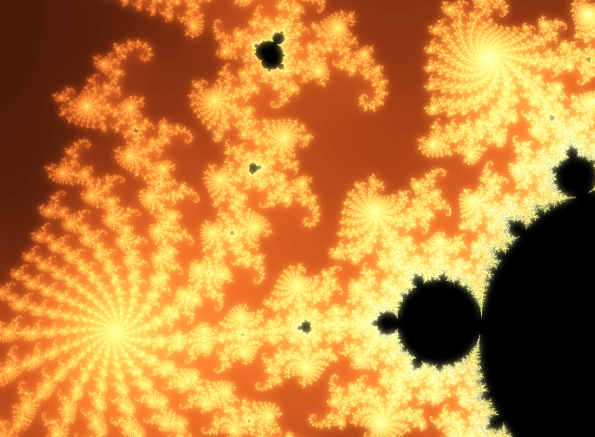

# mandelbrot-shader-webgl2

Mandelbrot shader implemented using TypeScript and WebGL2 (GLES 3) and no other dependencies.

OpenGL ES specifies floating point range to be at least 16 bits when using `highp` in shaders, which will result in a pretty poor ability to zoom. It may work a bit better when running in a desktop browser.

Not much to say otherwise, it is a classic Mandelbrot fractal :-)

- `tsc -w` - run TypeScript compiler in watch mode to automatically compile changed files
- Uses fragment shaders for fractal rendering

Live: https://jakobmollas.github.io/mandelbrot-shader-webgl/

